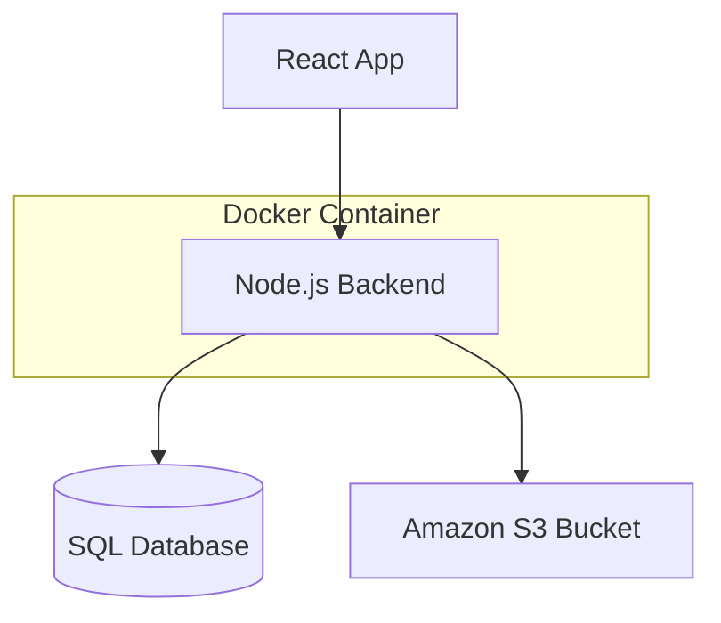

# Plant Marketplace & Tracker: Architecture Design

## 1. Product Goals
* **Marketplace:** Allow users to buy, sell, and trade plants within the community.
* **Tracker:** Help users monitor watering schedules, track growth, and log the health of their personal plant collection.

## 2. Learning Objectives
* **Infrastructure:** Implement and optimize Docker multi-stage builds for the backend API.
* **Storage:** Manage secure image uploads and retrieval using Amazon S3.
* **Database Optimisation:** Offload complex logic (e.g., ranking popular marketplace plants or sorting by proximity) to the SQL database layer rather than fetching and processing it all on the client.
* **System Design:** Map out scalable architecture before writing code.
* **Map Tracking:** Have a map to allow users to pinpoint where they want to trade/sell plants

## 3. Tech Stack
* **Mobile:** Expo
* **Frontend:** React.js (Web) / React Native (Mobile)
* **Backend:** Node.js 
* **Database:** PostgreSQL (or MySQL)
* **Infrastructure:** Docker, Amazon S3

## 4. Architecture & Data Flow

Example diagram:

## 5. Phase 1 (MVP) Scope
* [x] Set up GitHub repository, Projects board, and this design doc.
* [ ] Work through Learning Goals and Objectives, and Tech Stack.